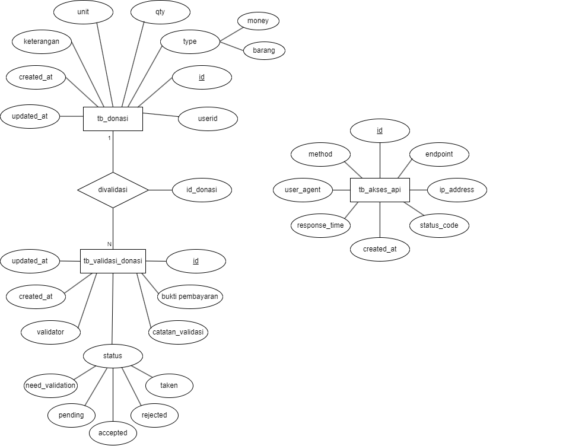

# API Dokumentasi MDonasi

## Table of Contents / Navigation

- [Deskripsi](#deskripsi)
- [Base URL](#base-url)
- [ERD](#erd)
- [Endpoints](#endpoints)
  - [Manajemen Donasi](#manajemen-donasi)
    - [1. Membuat Donasi Baru](#1-membuat-donasi-baru)
    - [2. Mendapatkan Daftar Donasi](#2-mendapatkan-daftar-donasi)
    - [3. Mendapatkan Donasi Berdasarkan ID](#3-mendapatkan-donasi-berdasarkan-id)
    - [4. Mendapatkan Donasi Berdasarkan Type donasi](#4-mendapatkan-donasi-berdasarkan-type-donasi)
    - [5. Mendapatkan Donasi Berdasarkan Status Donasi](#5-mendapatkan-donasi-berdasarkan-status-donasi)
    - [6. Mendapatkan Donasi Berdasarkan ID User](#6-mendapatkan-donasi-berdasarkan-id-user)
    - [7. Menghapus Data Donasi](#7-menghapus-data-donasi)
    - [8. Mengubah data donasi](#8-mengubah-data-donasi)
  - [Validasi Donasi](#validasi-donasi)
    - [1. Donatur Membuat Validasi Donasi](#1-donatur-membuat-validasi-donasi)
    - [2. Admin memvalidasi donasi](#2-admin-memvalidasi-donasi)
    - [3. Volunteer mengambil donasi](#3-volunteer-mengambil-donasi-dan-mengubah-status-validasi-donasi-menjadi-taken)
    - [4. Mendapatkan Detail Validasi Donasi](#4-mendapatkan-detail-validasi-donasi)
  - [Riwayat Donasi](#riwayat-donasi)
    - [1. Mendapatkan Semua Riwayat Donasi (Admin)](#1-mendapatkan-semua-riwayat-donasi-admin)
    - [2. Mendapatkan Riwayat Donasi Berdasarkan ID User](#2-mendapatkan-riwayat-donasi-berdasarkan-id-user)
  - [Riwayat Akses API](#riwayat-akses-api)
    - [1. Mendapatkan Riwayat Akses API](#1-mendapatkan-riwayat-akses-api)
- [Status Kode](#status-kode)
- [Status Donasi](#status-donasi)
- [Struktur Database](#struktur-database)
  - [Tabel tb_donasi](#tabel-tb_donasi)
  - [Tabel tb_validasi_donasi](#tabel-tb_validasi_donasi)
  - [Tabel tb_akses_api](#tabel-tb_akses_api)


## PERUBAHAN TERBARU [penting]
```
1. Perubahan pada endpoint validasi donasi, sekarang tidak mengambil id dari path, tapi sekarang membutuhkan id_donasi pada body , mohon maaf untuk yang menggunakan sebelumnya, karena ada permintaan perbaikan

2. Sekarang saat donatur membuat donasi, otomatis membuat validasi donasi, jadi tidak perlu lagi membuat validasi donasi secara terpisah, cukup buat donasi saja, dan donasi akan otomatis dibuatkan validasinya dan satusnya akan need validation, dan donatur bisa mengirimkan bukti pembayaran pada endpoint validasi donasi maka statusnya akan menjadi pending, dan admin bisa memvalidasi donasi tersebut dengan status accepted atau rejected, jika diterima maka status donasi akan menjadi success, jika ditolak maka status donasi akan menjadi failed

3. Perubahan pada endpoint validasi donasi, sekarang volunteer bisa mengambil donasi yang sudah di accepted dan mengubah status validasi donasi menjadi taken, jika cancel donasi taken ubah lagi status validasi donasi menjadi accepted
```

## Deskripsi

API ini memungkinkan pengguna untuk mengelola transaksi donasi pada tabel donasi. API ini menyediakan endpoint untuk membuat, melihat, mengubah, dan menghapus data donasi, serta fitur untuk validasi donasi, riwayat donasi, dan melacak riwayat akses API.

## Base URL

```text
https://api-mdonasi-core.vercel.app/api/
```

api ini membutuhkan Auth bearer token untuk mengakses endpoint . Token yang sudah diambil dari modul 1, bisa digunakan untuk mengakses API ini tanpa perlu untuk generate lagi / memanggil request verifytoken dari modul 1, karena api ini sudah memanggil verifytoken dari modul 1, jadi anda cukup sertakan Auth Bearer tokennya saja. Pastikan untuk menyertakan token untuk setiap request


## ERD



Dari gambar database diatas, sistem MDonasi terdiri dari beberapa tabel utama:

- **tb_donasi**: Menyimpan data donasi seperti nama donatur, email, nominal, dll
- **tb_validasi_donasi**: Menyimpan data validasi untuk setiap donasi
- **tb_akses_api**: Mencatat semua akses ke API

## Endpoints

### Manajemen Donasi

#### 1. Membuat Donasi Baru
Catatan:<br>
Hanya **Admin dan User** tersebut yang bisa membuat donasi. <br>
**Otomatis** membuat validation donasi.

- **Method:** POST
- **Path:** `/donasi`
- **Content-Type:** application/json

##### Request Body

```json
{
  "userid": "{userid}",
  "type": "uang",
  "qty": 100000,
  "unit": "rupiah",
  "keterangan": "Semoga bermanfaat",
}
```

##### Response Success

- **Status Code:** 201 Created
- **Content-Type:** application/json

```json
{
  "success": true,
  "message": "Donasi berhasil dibuat",
  "data": {
    "id": 1,
    "userid": "{userid}",
    "type": "uang",
    "qty": 100000,
    "unit": "rupiah",
    "keterangan": "Semoga bermanfaat",
    "status": "need validation",
    "created_at": "2025-05-21T14:30:00.000Z"
  }
}
```

##### Response Error

- **Status Code:** 400 Bad Request
- **Content-Type:** application/json

```json
{
  "success": false,
  "message": "Data donasi tidak lengkap",
  "errors": [
    "Nama donatur harus diisi",
    "Nominal harus berupa angka"
  ]
}
```

#### 2. Mendapatkan Daftar Donasi

- **Method:** GET
- **Path:** `/donasi`

##### Query Parameters

- `page` (optional): Halaman yang ingin ditampilkan (default: 1)
- `limit` (optional): Jumlah data per halaman (default: 10)
- `status` (optional): Filter berdasarkan status donasi ('need_validation','pending', 'success', 'failed','taken')

##### Response Success

- **Status Code:** 200 OK
- **Content-Type:** application/json

```json
{
  "success": true,
  "message": "Daftar donasi",
  "data": [
    {
      "id": 1,
      "userid": "{userid}",
      "type": "uang",
      "qty": 100000,
      "unit": "rupiah",
      "keterangan": "Semoga bermanfaat",
      "status": "success",
      "created_at": "2025-05-21T14:30:00.000Z"
    },
    {
      "id": 2,
      "userid": "{userid}",
      "type": "barang",
      "qty": 10,
      "unit": "dus",
      "keterangan": "baju, celana, selimut",
      "status": "pending",
      "created_at": "2025-05-21T15:45:00.000Z"
    }
  ],
  "pagination": {
    "current_page": 1,
    "total_pages": 5,
    "total_items": 47,
    "limit": 10
  }
}
```

#### 3. Mendapatkan Donasi Berdasarkan ID

- **Method:** GET
- **Path:** `/donasi/{idDonasi}`

##### Response Success

- **Status Code:** 200 OK
- **Content-Type:** application/json

```json
{
  "success": true,
  "message": "Donasi berhasil ditemukan",
  "data": {
    "id": 1,
    "userid": "{userid}",
    "type": "uang",
    "qty": 100000,
    "unit": "rupiah",
    "keterangan": "Semoga bermanfaat",
    "status": "success",
    "created_at": "2025-05-21T14:30:00.000Z"
  }
}
```

##### Response Error

- **Status Code:** 404 Not Found
- **Content-Type:** application/json

```json
{
  "success": false,
  "message": "Donasi dengan id 999 tidak ditemukan"
}
```

#### 4. Mendapatkan Donasi Berdasarkan Type donasi

- **Method:** GET
- **Path:** `/donasi/type/{uang/barang}`

##### Response Success

- **Status Code:** 200 OK
- **Content-Type:** application/json

```json

{
"success": true,
"message": "Daftar donasi dengan tipe uang",
"data": [
  {
    "id": 12,
    "keterangan": "Donasi uang tunai",
    "userid": 1,
    "qty": 500000,
    "unit": "rupiah",
    "type": "uang",
    "created_at": "2025-05-26T05:47:47.000Z",
    "updated_at": "2025-05-26T05:47:47.000Z",
    "status_validasi": null
  }],
  "pagination": {
  "current_page": 1,
  "total_pages": 1,
  "total_items": 6,
  "limit": 10
}
}
```

#### 5. Mendapatkan Donasi Berdasarkan Status Donasi

- **Method:** GET
- **Path:** `/donasi/status/{need_validation/pending/accepted/rejected/taken}`

##### Response Success

- **Status Code:** 200 OK
- **Content-Type:** application/json

```json
{
  "success": true,
  "message": "Daftar donasi dengan status accepted",
  "data": [
    {
      "id": 7,
      "keterangan": "Donasi uang pembangunan",
      "userid": 7,
      "qty": 2000000,
      "unit": "rupiah",
      "type": "uang",
      "created_at": "2025-05-24T07:17:38.000Z",
      "updated_at": "2025-05-24T07:17:38.000Z",
      "status_validasi": "accepted"
    },
    {
      "id": 1,
      "keterangan": "Donasi uang tunai",
      "userid": 1,
      "qty": 500000,
      "unit": "rupiah",
      "type": "uang",
      "created_at": "2025-05-24T07:17:38.000Z",
      "updated_at": "2025-05-24T07:17:38.000Z",
      "status_validasi": "accepted"
    },
  ],
  "pagination": {
    "current_page": 1,
    "total_pages": 1,
    "total_items": 5,
    "limit": 10
  }
}
```

#### 6. Mendapatkan Donasi Berdasarkan ID User

- **Method:** GET
- **Path:** `/donasi/user/{userID}`

##### Response Success

- **Status Code:** 200 OK
- **Content-Type:** application/json

```json
{
  "success": true,
  "message": "Donasi berhasil ditemukan",
  "data": {
    {
      "id": 1,
      "userid": "{userid}",
      "type": "uang",
      "qty": 100000,
      "unit": "rupiah",
      "keterangan": "Semoga bermanfaat",
      "status": "success",
      "created_at": "2025-05-21T14:30:00.000Z"
    },
    {
      "id": 2,
      "userid": "{userid}",
      "type": "barang",
      "qty": 10,
      "unit": "dus",
      "keterangan": "baju, celana, selimut",
      "status": "pending",
      "created_at": "2025-05-21T15:45:00.000Z"
    }
  }
}
```

##### Response Error

- **Status Code:** 404 Not Found
- **Content-Type:** application/json

```json
{
  "success": false,
  "message": "Donasi dengan user id 999 tidak ditemukan"
}
```

#### 7. Menghapus Data Donasi

- **Method:** DELETE
- **Path:** `/donasi/{idDonasi}`

##### Response Success

- **Status Code:** 200 OK
- **Content-Type:** application/json

```json
{
  "success": true,
  "message": "Donasi berhasil dihapus"
}
```

##### Response Error

- **Status Code:** 404 Not Found
- **Content-Type:** application/json

```json
{
  "success": false,
  "message": "Donasi dengan id 999 tidak ditemukan"
}
```

#### 8. Mengubah data donasi

- **Method:** PUT
- **Path:** `/donasi/{idDonasi}`
- **Content-Type:** application/json

##### Request Body

```json
{
  "userid": "{userid}",
  "type": "uang",
  "qty": 100000,
  "unit": "rupiah",
  "keterangan": "Semoga bermanfaat",
}
```

##### Response Success

- **Status Code:** 201 Created
- **Content-Type:** application/json

```json
{
  "success": true,
  "message": "Donasi berhasil ubah",
  "data": {
    "id": 1,
    "userid": "{userid}",
    "type": "uang",
    "qty": 100000,
    "unit": "rupiah",
    "keterangan": "Semoga bermanfaat",
    "status": "need validation",
    "created_at": "2025-05-21T14:30:00.000Z"
  }
}
```

##### Response Error

- **Status Code:** 400 Bad Request
- **Content-Type:** application/json

```json
{
  "success": false,
  "message": "Data donasi tidak lengkap",
  "errors": [
    "Nama donatur harus diisi",
    "Nominal harus berupa angka"
  ]
}
```

### Validasi Donasi

perhatikan perubahan sistem validasi donasi, endpoint sekarang tidak mengambil id dari path, tapi sekarang membutuhkan id donasi , mohon maaf untuk yang menggunakan sebelumnya, karena ada permintaan perbaikan 

#### 1. Donatur Membuat Validasi Donasi

- **Method:** POST
- **Path:** `/validasi-donasi/kirimbukti`
- **Content-Type:** application/json

##### Request Body

```json
{
  "id_donasi": 1,
  "bukti_pembayaran": "https://example.com/bukti-transfer.jpg",
  "catatan_validasi": "Pembayaran sudah masuk",
}
```

##### Response Success

- **Status Code:** 201 Created
- **Content-Type:** application/json

```json
{
  "success": true,
  "message": "Validasi donasi berhasil dibuat",
  "data": {
    "id": 1,
    "id_donasi": 1,
    "bukti_pembayaran": "https://example.com/bukti-transfer.jpg",
    "catatan_validasi": "Pembayaran sudah masuk",
    "status_validasi": "pending",
    "validator": "Admin",
    "created_at": "2025-05-21T16:30:00.000Z"
  }
}

{
  "success": true,
  "message": "Validasi donasi berhasil dibuat",
  "data": {
    "id": 1,
    "id_donasi": 1,
    "bukti_pembayaran": "https://example.com/bukti-transfer.jpg",
    "catatan_validasi": "Pembayaran sudah masuk",
    "status_validasi": "accepted",
    "validator": "Admin",
    "created_at": "2025-06-21T16:30:00.000Z"
  }
}
```

#### 2. Admin memvalidasi donasi

- **Method:** PUT
- **Path:** `/validasi-donasi/admin/validasibyadmin`
- **Content-Type:** application/json

##### Request Body

```json
{
  "id_donasi": 1,
  "status_validasi": "accepted / rejected",
  "catatan_validasi": "Pembayaran sudah dikonfirmasi",
  "validator": "Admin ronggo"
}
```

##### Response Success

- **Status Code:** 200 OK
- **Content-Type:** application/json

```json
{
  "success": true,
  "message": "Berhasil di validasi",
  "data": [
    "id": 1,
    "id_donasi": 1,
    "bukti_pembayaran": "https://example.com/bukti-transfer.jpg",
    "catatan_validasi": "Pembayaran sudah masuk",
    "status_validasi": "accepted",
    "validator": "Admin",
    "created_at": "2025-05-21T16:30:00.000Z"
  ],
}
```
#### 3. Volunteer mengambil donasi dan mengubah status validasi donasi menjadi taken

- **Method:** PUT
- **Path:** `/validasi-donasi/volunteer/takedonasi`

```json
{
  "id_donasi": 1,
  "status_validasi": "taken",
  "catatan_validasi": "Donasi sudah diambil oleh PT blabla",
  "validator": "PT BLABLA"
}
```
##### Jika cancel donasi taken ubah lagi status validasi donasi menjadi accepted
```json
{
  "id_donasi": 1,
  "status_validasi": "accepted", 
  "catatan_validasi": "Donasi tidak jadi diambil oleh PT blabla",
  "validator": "PT BLABLA"
}
```

##### Response Success

```json
{
  "success": true,
  "message": "Berhasil divalidasi",
  "data": {
    "id": 51,
    "id_donasi": 54,
    "bukti_pembayaran": "https://example.com/bukti-transfer54.jpg",
    "catatan_validasi": "Donasi sudah diambil oleh PT blabla",
    "status_validasi": "taken",
    "validator": "PT BLABLA",
    "created_at": "2025-06-09T15:39:34.000Z",
    "donasi": {
      "id": 54,
      "userid": 12,
      "type": "uang",
      "qty": 1000000,
      "unit": "rupiah",
      "keterangan": "Semoga bermanfaat",
      "status": "taken"
    }
  }
}
```
#### 4. Mendapatkan Detail Validasi Donasi

- **Method:** GET
- **Path:** `/validasi-donasi/detaildonasi`

```json
{
  "id_donasi": 1,
}
```

##### Response Success

- **Status Code:** 200 OK
- **Content-Type:** application/json

```json
{
  "success": true,
  "message": "Detail validasi donasi berhasil ditemukan",
  "data": {
    "id": 1,
    "id_donasi": 1,
    "bukti_pembayaran": "https://example.com/bukti-transfer.jpg",
    "catatan_validasi": "Pembayaran sudah masuk",
    "status_validasi": "valid",
    "validator": "Admin",
    "created_at": "2025-05-21T16:30:00.000Z",
    "donasi": {
      "id": 1,
      "userid": "{userid}",
      "type": "uang",
      "qty": 100000,
      "unit": "rupiah",
      "keterangan": "Semoga bermanfaat",
      "status": "success"
    }
  }
}
```

### Riwayat Donasi

#### 1. Mendapatkan Semua Riwayat Donasi (Admin)

- **Method:** GET
- **Path:** `donasi/riwayat-donasi/admin`

##### Query Parameters

- `page` (optional): Halaman yang ingin ditampilkan (default: 1)
- `limit` (optional): Jumlah data per halaman (default: 10)
- `id_donasi` (optional): Filter riwayat berdasarkan ID donasi

##### Response Success

- **Status Code:** 200 OK
- **Content-Type:** application/json

```json
{
  "success": true,
  "message": "Riwayat donasi berhasil diambil",
  "data": [
    {
      "userid" : 1,
      "data": [
        {
          "id": 1,
          "userid": "{userid}",
          "type": "uang",
          "qty": 100000,
          "unit": "rupiah",
          "keterangan": "Semoga bermanfaat",
          "status" : {
             "id": 1,
              "id_donasi": 1,
              "bukti_pembayaran": "https://example.com/bukti-transfer.jpg",
              "catatan_validasi": "Pembayaran sudah masuk",
              "status_validasi": "pending",
              "validator": "Admin",
              "created_at": "2025-05-21T16:30:00.000Z"
          },
          "created_at": "2025-05-21T14:30:00.000Z"
        },
        {
          "id": 2,
          "userid": "{userid}",
          "type": "barang",
          "qty": 10,
          "unit": "dus",
          "keterangan": "baju, celana, selimut",
          "status" : {
             "id": 1,
              "id_donasi": 1,
              "bukti_pembayaran": "https://example.com/bukti-transfer.jpg",
              "catatan_validasi": "Pembayaran sudah masuk",
              "status_validasi": "pending",
              "validator": "Admin",
              "created_at": "2025-05-21T16:30:00.000Z"
          },
          "created_at": "2025-05-21T15:45:00.000Z"
        }
      ]
    },
     {
      "userid" : 2,
      "data": [
        {
          "id": 1,
          "userid": "{userid}",
          "type": "uang",
          "qty": 100000,
          "unit": "rupiah",
          "keterangan": "Semoga bermanfaat",
          "status" : {
             "id": 1,
              "id_donasi": 1,
              "bukti_pembayaran": "https://example.com/bukti-transfer.jpg",
              "catatan_validasi": "Pembayaran sudah masuk",
              "status_validasi": "pending",
              "validator": "Admin",
              "created_at": "2025-05-21T16:30:00.000Z"
          },
          "created_at": "2025-05-21T14:30:00.000Z"
        },
        {
          "id": 2,
          "userid": "{userid}",
          "type": "barang",
          "qty": 10,
          "unit": "dus",
          "keterangan": "baju, celana, selimut",
           "status" : {
             "id": 1,
              "id_donasi": 1,
              "bukti_pembayaran": "https://example.com/bukti-transfer.jpg",
              "catatan_validasi": "Pembayaran sudah masuk",
              "status_validasi": "pending",
              "validator": "Admin",
              "created_at": "2025-05-21T16:30:00.000Z"
          },
          "created_at": "2025-05-21T15:45:00.000Z"
        }
      ]
    },
  ],
  "pagination": {
    "current_page": 1,
    "total_pages": 4,
    "total_items": 35,
    "limit": 10
  }
}
```

#### 2. Mendapatkan Riwayat Donasi Berdasarkan ID User

- **Method:** GET
- **Path:** `/riwayat-donasi/{userId}`

##### Response Success

- **Status Code:** 200 OK
- **Content-Type:** application/json

```json
{
  "success": true,
  "message": "Riwayat donasi berhasil diambil",
  "userid" : 1,
  "data": [
    {
      "id": 1,
      "userid": "{userid}",
      "type": "uang",
      "qty": 100000,
      "unit": "rupiah",
      "keterangan": "Semoga bermanfaat",
      "status" : {
          "id": 1,
          "id_donasi": 1,
          "bukti_pembayaran": "https://example.com/bukti-transfer.jpg",
          "catatan_validasi": "Pembayaran sudah masuk",
          "status_validasi": "pending",
          "validator": "Admin",
          "created_at": "2025-05-21T16:30:00.000Z"
      },
      "created_at": "2025-05-21T14:30:00.000Z"
    },
    {
      "id": 2,
      "userid": "{userid}",
      "type": "barang",
      "qty": 10,
      "unit": "dus",
      "keterangan": "baju, celana, selimut",
      "status" : {
          "id": 1,
          "id_donasi": 1,
          "bukti_pembayaran": "https://example.com/bukti-transfer.jpg",
          "catatan_validasi": "Pembayaran sudah masuk",
          "status_validasi": "pending",
          "validator": "Admin",
          "created_at": "2025-05-21T16:30:00.000Z"
      },
      "created_at": "2025-05-21T15:45:00.000Z"
    }
  ]
}
```

### Riwayat Akses API

#### 1. Mendapatkan Riwayat Akses API

- **Method:** GET
- **Path:** `/akses-api`

##### Query Parameters

- `page` (optional): Halaman yang ingin ditampilkan (default: 1)
- `limit` (optional): Jumlah data per halaman (default: 10)
- `method` (optional): Filter berdasarkan method ('GET', 'POST', 'PATCH', 'DELETE')
- `status_code` (optional): Filter berdasarkan kode status (200, 201, 400, 404, dll)

##### Response Success

- **Status Code:** 200 OK
- **Content-Type:** application/json

```json
{
  "success": true,
  "message": "Riwayat akses API berhasil diambil",
  "data": [
    {
      "id": 1,
      "endpoint": "/api/donasi",
      "method": "POST",
      "ip_address": "192.168.1.1",
      "user_agent": "Mozilla/5.0 (Windows NT 10.0; Win64; x64) AppleWebKit/537.36",
      "status_code": 201,
      "response_time": 120,
      "created_at": "2025-05-21T14:30:00.000Z"
    },
    {
      "id": 2,
      "endpoint": "/api/donasi",
      "method": "GET",
      "ip_address": "192.168.1.2",
      "user_agent": "Mozilla/5.0 (Macintosh; Intel Mac OS X 10_15_7)",
      "status_code": 200,
      "response_time": 85,
      "created_at": "2025-05-21T14:35:00.000Z"
    }
  ],
  "pagination": {
    "current_page": 1,
    "total_pages": 8,
    "total_items": 78,
    "limit": 10
  }
}
```


## Status Kode

| Status Code | Description |
|-------------|-------------|
| 200 | OK - Permintaan berhasil |
| 201 | Created - Data berhasil dibuat |
| 400 | Bad Request - Parameter tidak valid atau tidak lengkap |
| 401 | Unauthorized - Autentikasi diperlukan |
| 403 | Forbidden - Tidak memiliki izin untuk mengakses resource |
| 404 | Not Found - Resource tidak ditemukan |
| 500 | Internal Server Error - Kesalahan pada server |

## Status Donasi

- `need_validation` - Menunggu user mengirimkan validasi
- `pending` - Menunggu validasi dari admin
- `accepted` - Donasi berhasil di validasi admin
- `rejected` - Donasi gagal
- `taken` - Donasi telah diambil

## Struktur Database

### Tabel tb_donasi

| Field | Tipe | Deskripsi |
|-------|------|-----------|
| id | INT | Primary Key, Auto Increment |
| keterangan | VARCHAR(100) | Keterangan isi donasi |
| userid | BASED ON MODUL 1 | id donatur |
| qty | INT | Jumlah quantity donasi |
| unit | VARCHAR(100) | unit donasi (rupiah/pcs/dus ..dst) |
| type | ENUM(uang/barang) | Tipe donasi |
| created_at | TIMESTAMP | Waktu pembuatan data donasi |
| updated_at | TIMESTAMP | Waktu terakhir pembaruan data donasi |

### Tabel tb_validasi_donasi

| Field | Tipe | Deskripsi |
|-------|------|-----------|
| id | INT | Primary Key, Auto Increment |
| id_donasi | INT | Foreign Key ke tabel tb_donasi |
| bukti_pembayaran | VARCHAR(255) | URL bukti pembayaran |
| catatan_validasi | TEXT | Catatan dari validator |
| status | ENUM(need_validation, pending, accepted, rejected, taken) | Status dari donasi |
| validator | VARCHAR(100) | Nama validator |
| created_at | TIMESTAMP | Waktu pembuatan data validasi |
| updated_at | TIMESTAMP | Waktu terakhir pembaruan data validasi |

### Tabel tb_akses_api

| Field | Tipe | Deskripsi |
|-------|------|-----------|
| id | INT | Primary Key, Auto Increment |
| endpoint | VARCHAR(255) | Endpoint API yang diakses |
| method | VARCHAR(10) | Method HTTP yang digunakan |
| ip_address | VARCHAR(50) | Alamat IP pengguna |
| user_agent | VARCHAR(255) | User agent pengguna |
| status_code | INT | Kode status HTTP response |
| response_time | INT | Waktu respons dalam milidetik |
| created_at | TIMESTAMP | Waktu akses |
