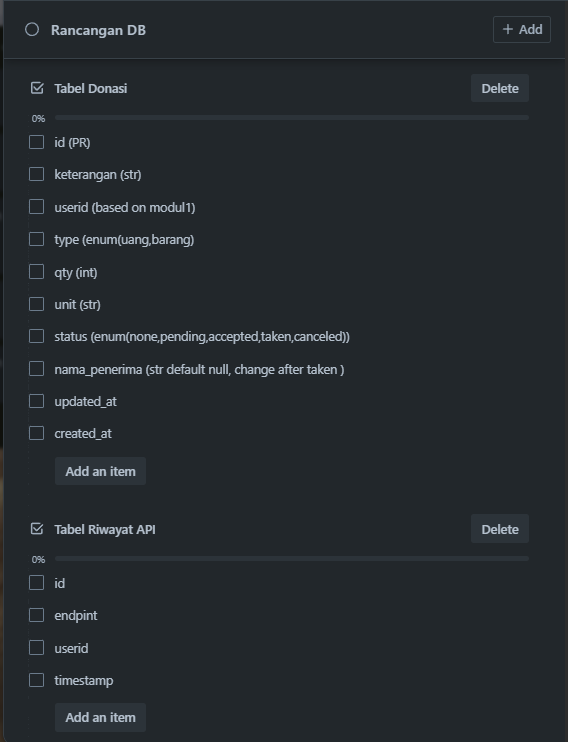
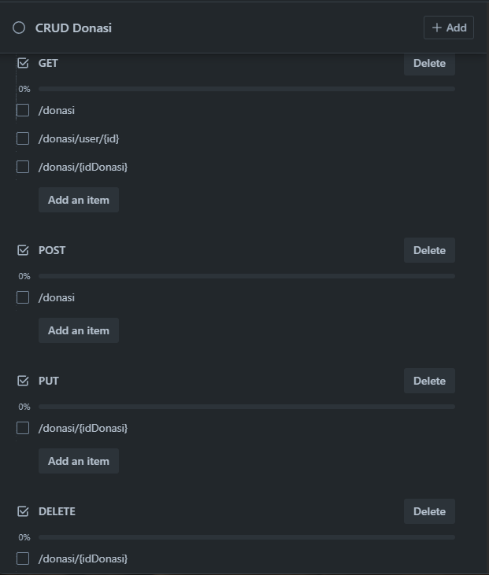
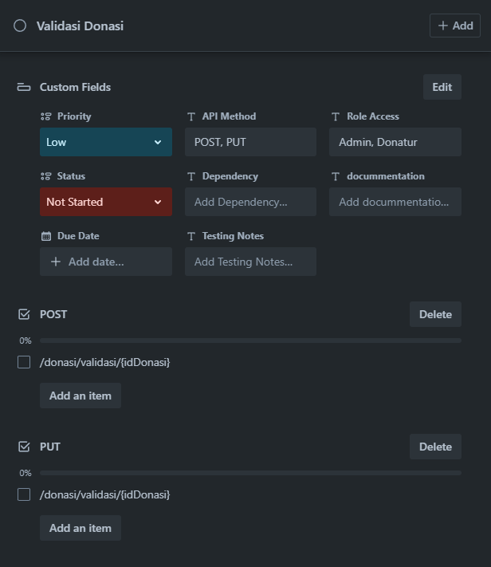
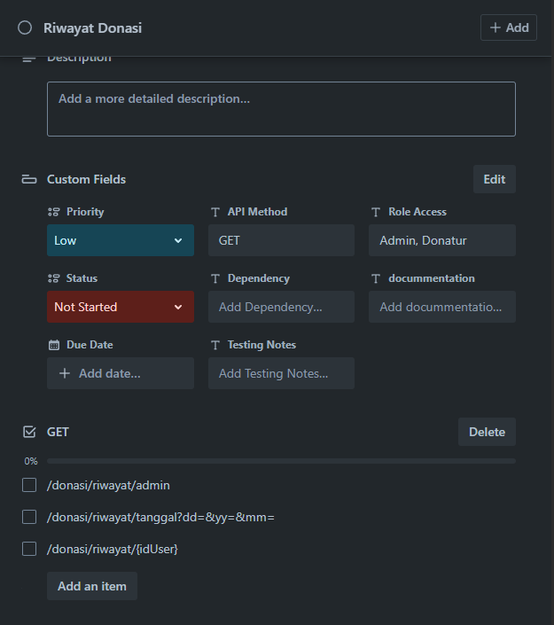
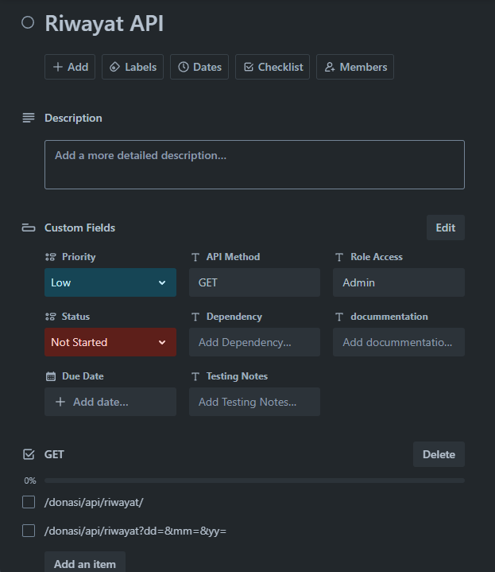

# API Dokumentasi MDonasi

## Deskripsi

API ini memungkinkan pengguna untuk mengelola transaksi donasi pada tabel donasi. API ini menyediakan endpoint untuk membuat, melihat, mengubah, dan menghapus data donasi, serta fitur untuk validasi donasi, riwayat donasi, dan melacak riwayat akses API.

## Base URL

```
http://url-api/api
```

## Database Schema

```
butuh tabel sql
```
<!--  -->

## ERD

```
butuh ERD
```

Dari gambar database diatas, sistem MDonasi terdiri dari beberapa tabel utama:

- **tb_donasi**: Menyimpan data donasi seperti nama donatur, email, nominal, dll
- **tb_validasi_donasi**: Menyimpan data validasi untuk setiap donasi
- **tb_riwayat_donasi**: Mencatat setiap perubahan status donasi
- **tb_akses_api**: Mencatat semua akses ke API

## Endpoints

### Manajemen Donasi

#### 1. Membuat Donasi Baru

- **Method:** POST
- **Path:** `/donasi`
- **Content-Type:** application/json

##### Request Body

```json
{
  "userid": "{userid}",
  "type": "money",
  "qty": 100000,
  "unit": "rupiah",
  "keterangan": "Semoga bermanfaat",
}
```

##### Response Success

- **Status Code:** 201 Created
- **Content-Type:** application/json

```json
{
  "success": true,
  "message": "Donasi berhasil dibuat",
  "data": {
    "id": 1,
    "userid": "{userid}",
    "type": "money",
    "qty": 100000,
    "unit": "rupiah",
    "keterangan": "Semoga bermanfaat",
    "status": "need validation",
    "created_at": "2025-05-21T14:30:00.000Z"
  }
}
```

##### Response Error

- **Status Code:** 400 Bad Request
- **Content-Type:** application/json

```json
{
  "success": false,
  "message": "Data donasi tidak lengkap",
  "errors": [
    "Nama donatur harus diisi",
    "Nominal harus berupa angka"
  ]
}
```

#### 2. Mendapatkan Daftar Donasi

- **Method:** GET
- **Path:** `/donasi`

##### Query Parameters

- `page` (optional): Halaman yang ingin ditampilkan (default: 1)
- `limit` (optional): Jumlah data per halaman (default: 10)
- `status` (optional): Filter berdasarkan status donasi ('need_validation','pending', 'success', 'failed','taken')

##### Response Success

- **Status Code:** 200 OK
- **Content-Type:** application/json

```json
{
  "success": true,
  "message": "Daftar donasi",
  "data": [
    {
      "id": 1,
      "userid": "{userid}",
      "type": "money",
      "qty": 100000,
      "unit": "rupiah",
      "keterangan": "Semoga bermanfaat",
      "status": "success",
      "created_at": "2025-05-21T14:30:00.000Z"
    },
    {
      "id": 2,
      "userid": "{userid}",
      "type": "barang",
      "qty": 10,
      "unit": "dus",
      "keterangan": "baju, celana, selimut",
      "status": "pending",
      "created_at": "2025-05-21T15:45:00.000Z"
    }
  ],
  "pagination": {
    "current_page": 1,
    "total_pages": 5,
    "total_items": 47,
    "limit": 10
  }
}
```

#### 3. Mendapatkan Donasi Berdasarkan ID

- **Method:** GET
- **Path:** `/donasi/{idDonasi}`

##### Response Success

- **Status Code:** 200 OK
- **Content-Type:** application/json

```json
{
  "success": true,
  "message": "Donasi berhasil ditemukan",
  "data": {
    "id": 1,
    "userid": "{userid}",
    "type": "money",
    "qty": 100000,
    "unit": "rupiah",
    "keterangan": "Semoga bermanfaat",
    "status": "success",
    "created_at": "2025-05-21T14:30:00.000Z"
  }
}
```

##### Response Error

- **Status Code:** 404 Not Found
- **Content-Type:** application/json

```json
{
  "success": false,
  "message": "Donasi dengan id 999 tidak ditemukan"
}
```

#### 4. Mendapatkan Donasi Berdasarkan ID User

- **Method:** GET
- **Path:** `/donasi/user/{userID}`

##### Response Success

- **Status Code:** 200 OK
- **Content-Type:** application/json

```json
{
  "success": true,
  "message": "Donasi berhasil ditemukan",
  "data": {
    {
      "id": 1,
      "userid": "{userid}",
      "type": "money",
      "qty": 100000,
      "unit": "rupiah",
      "keterangan": "Semoga bermanfaat",
      "status": "success",
      "created_at": "2025-05-21T14:30:00.000Z"
    },
    {
      "id": 2,
      "userid": "{userid}",
      "type": "barang",
      "qty": 10,
      "unit": "dus",
      "keterangan": "baju, celana, selimut",
      "status": "pending",
      "created_at": "2025-05-21T15:45:00.000Z"
    }
  }
}
```

##### Response Error

- **Status Code:** 404 Not Found
- **Content-Type:** application/json

```json
{
  "success": false,
  "message": "Donasi dengan user id 999 tidak ditemukan"
}
```

#### 5. Menghapus Data Donasi

- **Method:** DELETE
- **Path:** `/donasi/{idDonasi}`

##### Response Success

- **Status Code:** 200 OK
- **Content-Type:** application/json

```json
{
  "success": true,
  "message": "Donasi berhasil dihapus"
}
```

##### Response Error

- **Status Code:** 404 Not Found
- **Content-Type:** application/json

```json
{
  "success": false,
  "message": "Donasi dengan id 999 tidak ditemukan"
}
```

#### 6. Mengubah data donasi

- **Method:** PUT
- **Path:** `/donasi/{idDonasi}`
- **Content-Type:** application/json

##### Request Body

```json
{
  "userid": "{userid}",
  "type": "money",
  "qty": 100000,
  "unit": "rupiah",
  "keterangan": "Semoga bermanfaat",
}
```

##### Response Success

- **Status Code:** 201 Created
- **Content-Type:** application/json

```json
{
  "success": true,
  "message": "Donasi berhasil ubah",
  "data": {
    "id": 1,
    "userid": "{userid}",
    "type": "money",
    "qty": 100000,
    "unit": "rupiah",
    "keterangan": "Semoga bermanfaat",
    "status": "need validation",
    "created_at": "2025-05-21T14:30:00.000Z"
  }
}
```

##### Response Error

- **Status Code:** 400 Bad Request
- **Content-Type:** application/json

```json
{
  "success": false,
  "message": "Data donasi tidak lengkap",
  "errors": [
    "Nama donatur harus diisi",
    "Nominal harus berupa angka"
  ]
}
```

### Validasi Donasi

#### 1. Donatur Membuat Validasi Donasi

- **Method:** POST
- **Path:** `/validasi-donasi/{idDonasi}`
- **Content-Type:** application/json

##### Request Body

```json
{
  "id_donasi": 1,
  "bukti_pembayaran": "https://example.com/bukti-transfer.jpg",
  "catatan_validasi": "Pembayaran sudah masuk",
}
```

##### Response Success

- **Status Code:** 201 Created
- **Content-Type:** application/json

```json
{
  "success": true,
  "message": "Validasi donasi berhasil dibuat",
  "data": {
    "id": 1,
    "id_donasi": 1,
    "bukti_pembayaran": "https://example.com/bukti-transfer.jpg",
    "catatan_validasi": "Pembayaran sudah masuk",
    "status_validasi": "pending",
    "validator": "Admin",
    "created_at": "2025-05-21T16:30:00.000Z"
  }
}

{
  "success": true,
  "message": "Validasi donasi berhasil dibuat",
  "data": {
    "id": 1,
    "id_donasi": 1,
    "bukti_pembayaran": "https://example.com/bukti-transfer.jpg",
    "catatan_validasi": "Pembayaran sudah masuk",
    "status_validasi": "accepted",
    "validator": "Admin",
    "created_at": "2025-06-21T16:30:00.000Z"
  }
}
```

#### 2. Admin memvalidasi donasi

- **Method:** PUT
- **Path:** `/validasi-donasi/admin/{idDonasi}`
- **Content-Type:** application/json

##### Request Body

```json
{
  "id_validasi": "{id_validasi}",
  "status_validasi": "accepted / rejected",
  "catatan_validasi": "Pembayaran sudah dikonfirmasi",
  "validator": "Admin"
}
```

##### Response Success

- **Status Code:** 200 OK
- **Content-Type:** application/json

```json
{
  "success": true,
  "message": "Berhasil di validasi",
  "data": [
    "id": 1,
    "id_donasi": 1,
    "bukti_pembayaran": "https://example.com/bukti-transfer.jpg",
    "catatan_validasi": "Pembayaran sudah masuk",
    "status_validasi": "valid",
    "validator": "Admin",
    "created_at": "2025-05-21T16:30:00.000Z"
  ],
}
```

#### 3. Mendapatkan Detail Validasi Donasi

- **Method:** GET
- **Path:** `/validasi-donasi/{idDonasi}`

##### Response Success

- **Status Code:** 200 OK
- **Content-Type:** application/json

```json
{
  "success": true,
  "message": "Detail validasi donasi berhasil ditemukan",
  "data": {
    "id": 1,
    "id_donasi": 1,
    "bukti_pembayaran": "https://example.com/bukti-transfer.jpg",
    "catatan_validasi": "Pembayaran sudah masuk",
    "status_validasi": "valid",
    "validator": "Admin",
    "created_at": "2025-05-21T16:30:00.000Z",
    "donasi": {
      "id": 1,
      "userid": "{userid}",
      "type": "money",
      "qty": 100000,
      "unit": "rupiah",
      "keterangan": "Semoga bermanfaat",
      "status": "success"
    }
  }
}
```

### Riwayat Donasi

#### 1. Mendapatkan Semua Riwayat Donasi (Admin)

- **Method:** GET
- **Path:** `donasi/riwayat-donasi/admin`

##### Query Parameters

- `page` (optional): Halaman yang ingin ditampilkan (default: 1)
- `limit` (optional): Jumlah data per halaman (default: 10)
- `id_donasi` (optional): Filter riwayat berdasarkan ID donasi

##### Response Success

- **Status Code:** 200 OK
- **Content-Type:** application/json

```json
{
  "success": true,
  "message": "Riwayat donasi berhasil diambil",
  "data": [
    {
      "userid" : 1,
      "data": [
        {
          "id": 1,
          "userid": "{userid}",
          "type": "money",
          "qty": 100000,
          "unit": "rupiah",
          "keterangan": "Semoga bermanfaat",
          "status" : {
             "id": 1,
              "id_donasi": 1,
              "bukti_pembayaran": "https://example.com/bukti-transfer.jpg",
              "catatan_validasi": "Pembayaran sudah masuk",
              "status_validasi": "pending",
              "validator": "Admin",
              "created_at": "2025-05-21T16:30:00.000Z"
          },
          "created_at": "2025-05-21T14:30:00.000Z"
        },
        {
          "id": 2,
          "userid": "{userid}",
          "type": "barang",
          "qty": 10,
          "unit": "dus",
          "keterangan": "baju, celana, selimut",
          "status" : {
             "id": 1,
              "id_donasi": 1,
              "bukti_pembayaran": "https://example.com/bukti-transfer.jpg",
              "catatan_validasi": "Pembayaran sudah masuk",
              "status_validasi": "pending",
              "validator": "Admin",
              "created_at": "2025-05-21T16:30:00.000Z"
          },
          "created_at": "2025-05-21T15:45:00.000Z"
        }
      ]
    },
     {
      "userid" : 2,
      "data": [
        {
          "id": 1,
          "userid": "{userid}",
          "type": "money",
          "qty": 100000,
          "unit": "rupiah",
          "keterangan": "Semoga bermanfaat",
          "status" : {
             "id": 1,
              "id_donasi": 1,
              "bukti_pembayaran": "https://example.com/bukti-transfer.jpg",
              "catatan_validasi": "Pembayaran sudah masuk",
              "status_validasi": "pending",
              "validator": "Admin",
              "created_at": "2025-05-21T16:30:00.000Z"
          },
          "created_at": "2025-05-21T14:30:00.000Z"
        },
        {
          "id": 2,
          "userid": "{userid}",
          "type": "barang",
          "qty": 10,
          "unit": "dus",
          "keterangan": "baju, celana, selimut",
           "status" : {
             "id": 1,
              "id_donasi": 1,
              "bukti_pembayaran": "https://example.com/bukti-transfer.jpg",
              "catatan_validasi": "Pembayaran sudah masuk",
              "status_validasi": "pending",
              "validator": "Admin",
              "created_at": "2025-05-21T16:30:00.000Z"
          },
          "created_at": "2025-05-21T15:45:00.000Z"
        }
      ]
    },
  ],
  "pagination": {
    "current_page": 1,
    "total_pages": 4,
    "total_items": 35,
    "limit": 10
  }
}
```

#### 2. Mendapatkan Riwayat Donasi Berdasarkan ID User

- **Method:** GET
- **Path:** `/riwayat-donasi/{userId}`

##### Response Success

- **Status Code:** 200 OK
- **Content-Type:** application/json

```json
{
  "success": true,
  "message": "Riwayat donasi berhasil diambil",
  "userid" : 1,
  "data": [
    {
      "id": 1,
      "userid": "{userid}",
      "type": "money",
      "qty": 100000,
      "unit": "rupiah",
      "keterangan": "Semoga bermanfaat",
      "status" : {
          "id": 1,
          "id_donasi": 1,
          "bukti_pembayaran": "https://example.com/bukti-transfer.jpg",
          "catatan_validasi": "Pembayaran sudah masuk",
          "status_validasi": "pending",
          "validator": "Admin",
          "created_at": "2025-05-21T16:30:00.000Z"
      },
      "created_at": "2025-05-21T14:30:00.000Z"
    },
    {
      "id": 2,
      "userid": "{userid}",
      "type": "barang",
      "qty": 10,
      "unit": "dus",
      "keterangan": "baju, celana, selimut",
      "status" : {
          "id": 1,
          "id_donasi": 1,
          "bukti_pembayaran": "https://example.com/bukti-transfer.jpg",
          "catatan_validasi": "Pembayaran sudah masuk",
          "status_validasi": "pending",
          "validator": "Admin",
          "created_at": "2025-05-21T16:30:00.000Z"
      },
      "created_at": "2025-05-21T15:45:00.000Z"
    }
  ]
}
```

### Riwayat Akses API

#### 1. Mendapatkan Riwayat Akses API

- **Method:** GET
- **Path:** `/akses-api`

##### Query Parameters

- `page` (optional): Halaman yang ingin ditampilkan (default: 1)
- `limit` (optional): Jumlah data per halaman (default: 10)
- `method` (optional): Filter berdasarkan method ('GET', 'POST', 'PATCH', 'DELETE')
- `status_code` (optional): Filter berdasarkan kode status (200, 201, 400, 404, dll)

##### Response Success

- **Status Code:** 200 OK
- **Content-Type:** application/json

```json
{
  "success": true,
  "message": "Riwayat akses API berhasil diambil",
  "data": [
    {
      "id": 1,
      "endpoint": "/api/donasi",
      "method": "POST",
      "ip_address": "192.168.1.1",
      "user_agent": "Mozilla/5.0 (Windows NT 10.0; Win64; x64) AppleWebKit/537.36",
      "status_code": 201,
      "response_time": 120,
      "created_at": "2025-05-21T14:30:00.000Z"
    },
    {
      "id": 2,
      "endpoint": "/api/donasi",
      "method": "GET",
      "ip_address": "192.168.1.2",
      "user_agent": "Mozilla/5.0 (Macintosh; Intel Mac OS X 10_15_7)",
      "status_code": 200,
      "response_time": 85,
      "created_at": "2025-05-21T14:35:00.000Z"
    }
  ],
  "pagination": {
    "current_page": 1,
    "total_pages": 8,
    "total_items": 78,
    "limit": 10
  }
}
```

## Tampilan CRUD Donasi

<!--  -->

## Tampilan Validasi Donasi

<!--  -->

## Tampilan Riwayat Donasi

<!--  -->

## Tampilan Riwayat Akses API

<!--  -->

## Status Kode

| Status Code | Description |
|-------------|-------------|
| 200 | OK - Permintaan berhasil |
| 201 | Created - Data berhasil dibuat |
| 400 | Bad Request - Parameter tidak valid atau tidak lengkap |
| 401 | Unauthorized - Autentikasi diperlukan |
| 403 | Forbidden - Tidak memiliki izin untuk mengakses resource |
| 404 | Not Found - Resource tidak ditemukan |
| 500 | Internal Server Error - Kesalahan pada server |

## Status Donasi

- `need_validation` - Menunggu user mengirimkan validasi
- `pending` - Menunggu validasi dari admin
- `success` - Donasi berhasil di validasi admin
- `failed` - Donasi gagal
- `taken` - Donasi telah diambil penerima

## Struktur Database

### Tabel tb_donasi

| Field | Tipe | Deskripsi |
|-------|------|-----------|
| id | INT | Primary Key, Auto Increment |
| keterangan | VARCHAR(100) | Keterangan isi donasi |
| userid | BASED ON MODUL 1 | id donatur |
| qty | INT | Jumlah quantity donasi |
| unit | VARCHAR(100) | unit donasi (rupiah/pcs/dus ..dst) |
| type | ENUM(uang/barang) | Tipe donasi |
| created_at | TIMESTAMP | Waktu pembuatan data donasi |
| updated_at | TIMESTAMP | Waktu terakhir pembaruan data donasi |

### Tabel tb_validasi_donasi

| Field | Tipe | Deskripsi |
|-------|------|-----------|
| id | INT | Primary Key, Auto Increment |
| id_donasi | INT | Foreign Key ke tabel tb_donasi |
| bukti_pembayaran | VARCHAR(255) | URL bukti pembayaran |
| catatan_validasi | TEXT | Catatan dari validator |
| status | ENUM(need_validation, pending, accepted, rejected, taken) | Status dari donasi |
| validator | VARCHAR(100) | Nama validator |
| created_at | TIMESTAMP | Waktu pembuatan data validasi |
| updated_at | TIMESTAMP | Waktu terakhir pembaruan data validasi |

### Tabel tb_akses_api

| Field | Tipe | Deskripsi |
|-------|------|-----------|
| id | INT | Primary Key, Auto Increment |
| endpoint | VARCHAR(255) | Endpoint API yang diakses |
| method | VARCHAR(10) | Method HTTP yang digunakan |
| ip_address | VARCHAR(50) | Alamat IP pengguna |
| user_agent | VARCHAR(255) | User agent pengguna |
| status_code | INT | Kode status HTTP response |
| response_time | INT | Waktu respons dalam milidetik |
| created_at | TIMESTAMP | Waktu akses |
